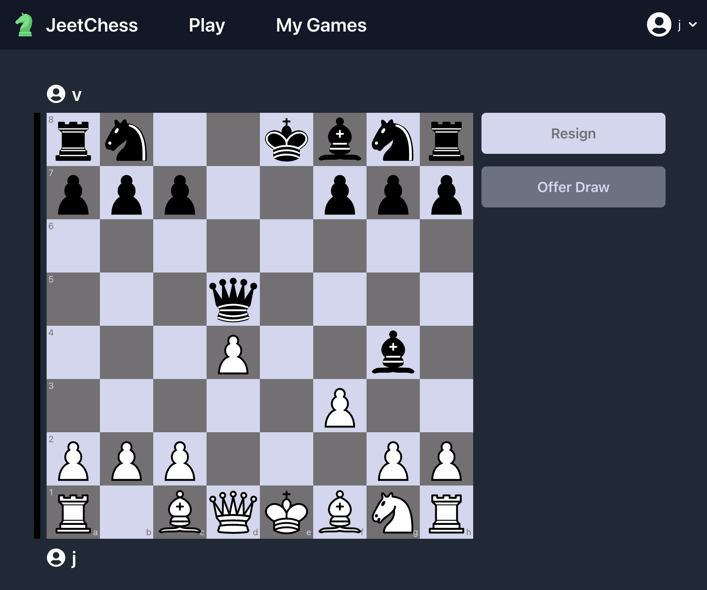

# JeetChess

Multiplayer chess site built with MongoDB, Express, React, Node, and Tailwind.

</img>

## Features

- Real-time multiplayer chess games
- Challenge friends with an account or spectate games as a guest
- View ongoing and previous games with the "My Games" tab
- Responsive and adaptive design for all platforms

## Setup Instructions

Follow these steps to deploy JeetChess locally:

### Prerequisites

- Node.js (v20.13.1)
- npm (v10.8.0)

### Installation

1. Clone the repository:
   ```
   git clone https://github.com/jeet-chugh/jeetchess.git
   cd jeetchess
   ```

2. Install dependencies:
   ```
   npm i
   ```

3. Set up the .ENV file:
   Create a `.env` file in the root directory and add the following variables:
   ```
    MONGO_URI=""
    PORT=5000
    ACCESS_TOKEN_SECRET=""
    REFRESH_TOKEN_SECRET=""
   ```
   Replace `ACCESS_TOKEN_SECRET` and `REFRESH_TOKEN_SECRET` with a secure random string.

4. Navigate to and start the frontend:
   ```
   cd client
   npm start
   ```

5. In a new terminal instance, navigate to and start the backend:
   ```
   cd server
   npm start
   ```

6. Open your browser and navigate to `http://localhost:3000`

### Project Structure

```
jeetchess/
├── client/              # React frontend
│   ├── src/
│   │   ├── auth/        # Auth Context
│   │   ├── components/  # React components
│   │   ├── services/    # Frontend API
│   │   ├── App.js       # Main App component
│   │   ├── AppRouter.js # Main App Router
│   │   ├── package.json # Dependencies and scripts
│   │   └── index.js     # Renders Main App
│   │
│   └── public/          # Public assets
│   
├── server/              # Express backend
│   ├── middleware/      # Auth handler
│   ├── models/          # Mongoose models
│   ├── routes/          # Express routes
│   ├── package.json     # Dependencies and scripts
│   └── server.js        # Entry point for the server
│   
├── .env                 # Environment variables
├── .gitignore           # Git ignore file
├── LICENSE              # MIT License
└── README.md            # This file
```

## License
 [MIT](LICENSE.md)

## Acknowledgements
 Special thanks to the contributors behind Chess.js, react-chessboard, and MaterialUI!